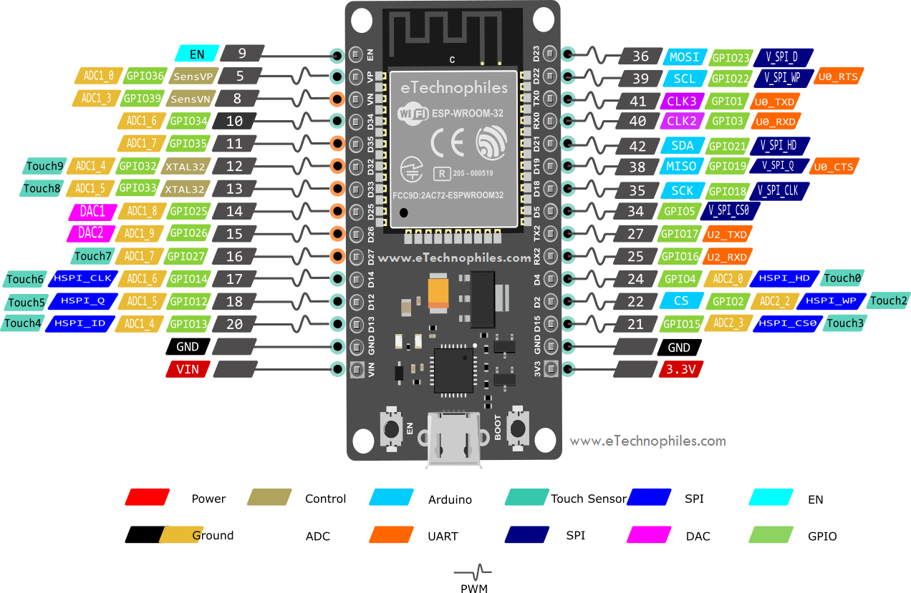
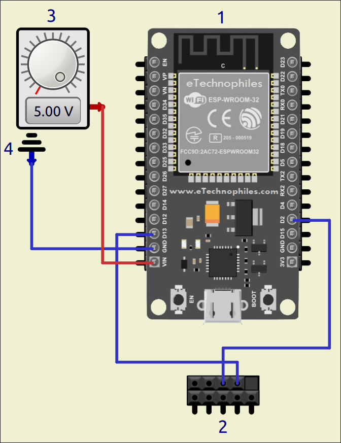

# SwitchPCWebServer

Me complace traer mi primer proyecto de programación y que te haya intrigado el interés por él.

Tal cómo dice el título, éste es un **WebServer** para un simple **Interruptor** remoto, utilizado para un computador con **Linux** (requiere de **Systemd** para una sencilla instalación, aunque **SysVinit** también, pero con algunas modificaciones) y **Windows**... también se podría, pero de momento no tengo mucho interés por hacerlo para éste **SO**.

Y gestionado por una **página web** mediante una conexión inalámbrica **Wi-Fi** y/o un **Punto de Acceso (AP)**.

Está diseñada para un **ESP32**, aunque un **ESP8266** también debería de funcionar cambiando algunas cosas.

Su funcionamiento es simple y se divide en 2 partes:

- ## Interruptor

	- Se encarga de **encender**, **apagar** y **apagar de forma forzada** el computador en caso de haberse trabado en el arranque o en caso de que el computador no le haya enviado la señal de **"conectado"**.
	
- ## Conexión inalámbrica

	- **Wi-Fi** y **AP**:
		- **Habilita** o **deshabilita** la conexión inalámbrica.
		- Configura el **SSID** y la **contraseña**.
		- Establece una conexión automática **DHCP** o **estática**.
	- **AP**:
		- Funciona cómo extensor de rango **Wi-Fi**, además de cumplir con la función de compartir el internet mediante **NAPT** (solo con la librería **<WiFi.h>** de **Arduino IDE/CLI** no funciona la de **PlatformIO**).

Todo gestionado desde una interfaz web desde la que se puede interactuar muy fácilmente.

**Nota:** Quizás más adelante haga otro proyecto centrándome más en la conexión inalámbrica **Wi-Fi** y **AP** para así quien lo necesite, no deba flashear un firmware para tener un **router** y/o **extensor de rango** con un **ESP32**.

## Montaje

- ### Diagrama

	
	*- Diagrama.*

- ### Conexiones

	
	*- Conexiones (hecho con SimulIDE).*

	**1.** ESP32
	**2.** Conector del panel frontal
	**3.** Fuente de alimentación positiva
	**4.** Fuente de alimentación negativa
	
	- **Nota:** También es posible hacerlo con **laptops** y requiere de testear y soldar conexiones a el voltaje positivo de **+3.3v** y negativo **GND** que va al boton de encendido, similar a cómo se ve en las siguientes imágenes.
	
		
		
		
		
		
		
		
		
		
		
		
		
## Método de instalación

- ### Requisitos para la instalación
	- Librerías necesarias:
		- **ArduinoJson:** https://github.com/bblanchon/ArduinoJson
		- **arduinoWebSockets:** https://github.com/Links2004/arduinoWebSockets
	- Extenciones:
		- **arduino-littlefs-upload** (para ArduinoIDE): https://github.com/earlephilhower/arduino-littlefs-upload
	- Subir el sketch:
		- **Automáticamente:** Tener conectado el **ESP32** al computador y especificar el puerto **USB** en el que está conectado y el tipo de **placa** para una instalación más rápida.
		- **Manualmente:** Subir el sketch con **Arduino IDE**
- ### Instalación
	
		sudo ./SwitchPCWebServer/install.sh
	
	o
	
		sudo bash SwitchPCWebServer/install.sh

	

